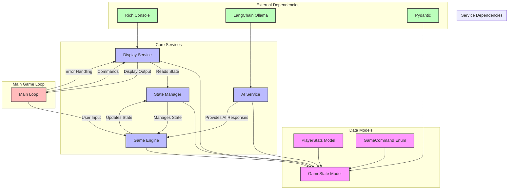
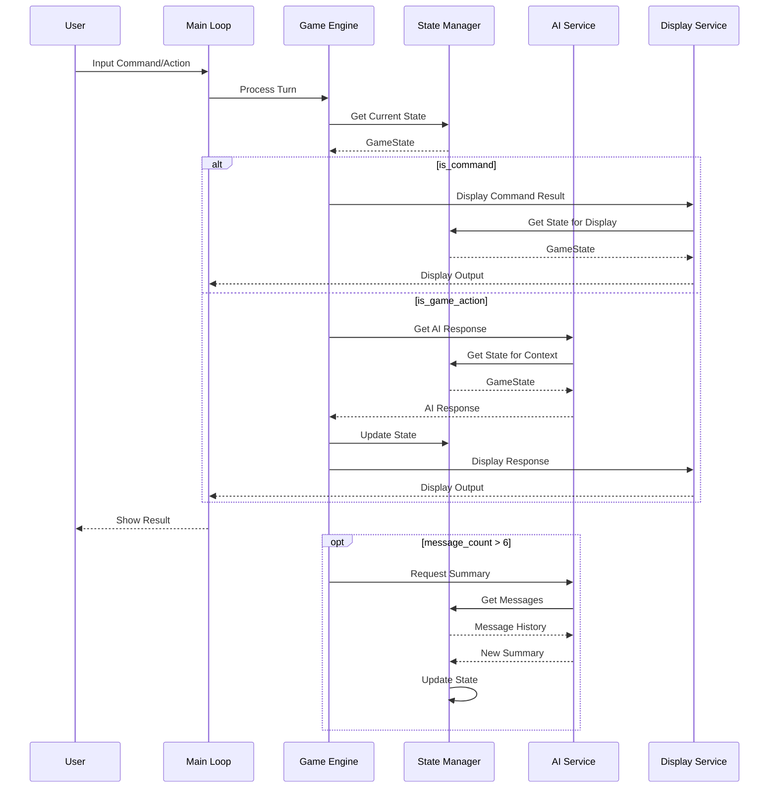

# D&D Text Adventure Game

A modular implementation of a D&D text adventure game using LangChain and Rich for the interface.

## Architecture Overview

The game is built with a modular architecture that separates concerns and maintains clear boundaries between components. Below is the architectural diagram showing the relationships between different modules:



### Component Description

1. **Data Models**
   - `PlayerStats Model`: Handles character statistics
   - `GameState Model`: Central state representation
   - `GameCommand Enum`: Available game commands

2. **Core Services**
   - `State Manager`: Maintains game state
   - `Display Service`: Handles UI rendering
   - `AI Service`: Manages LLM interactions
   - `Game Engine`: Orchestrates game flow

3. **External Dependencies**
   - Rich Console: Terminal UI
   - LangChain Ollama: AI model integration
   - Pydantic: Data validation

## Game Flow

The following sequence diagram shows how the components interact during a typical game turn:



### Flow Description

1. **Input Processing**
   - User input is received by the Main Loop
   - Game Engine determines if it's a command or game action

2. **Command Handling**
   - Commands are processed directly through the Display Service
   - State is retrieved and displayed accordingly

3. **Game Action Processing**
   - Actions are sent to the AI Service for response
   - State is updated based on the AI response
   - Results are displayed to the user

4. **Auto-Summarization**
   - After 6 messages, conversation is automatically summarized
   - Summary is stored in state for context

## Installation

```bash
pip install pydantic langchain-ollama langchain-core rich
```

## Usage

1. Create separate files for each module:
   - models.py
   - state_manager.py
   - display_service.py
   - ai_service.py
   - game_engine.py
   - main.py

2. Run the game:
```bash
python main.py
```

## Available Commands

- `/inventory` - Check your items
- `/stats` - View character stats
- `/quests` - Review active quests
- `/summary` - Recall recent adventures
- `quit` - Exit game

## Error Handling

The game includes comprehensive error handling at multiple levels:
- Input validation through Pydantic models
- Service-level error catching
- Rich error display to user
- State preservation on error

## Development Notes

- All state modifications go through State Manager
- Display Service handles all UI concerns
- AI Service manages all LLM interactions
- Game Engine orchestrates flow control